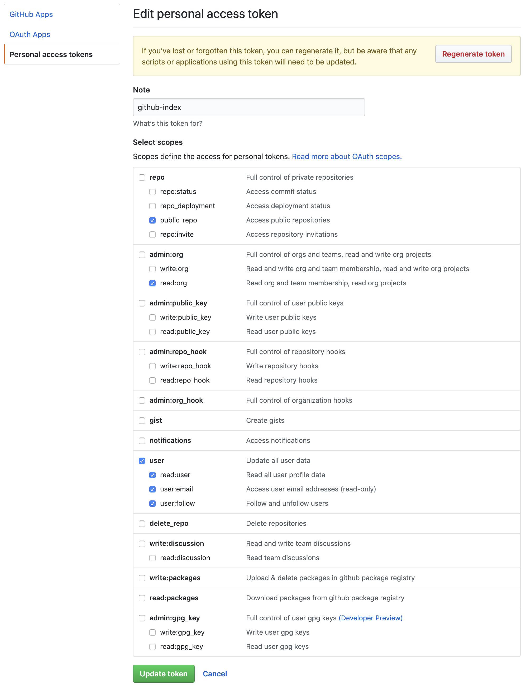

github-indexer
==============

Grabs data from GitHub and pushes it to an Elasticsearch instance

[](https://oclif.io)
[](https://npmjs.org/package/github-indexer)
[](https://circleci.com/gh/zencrepes/github-indexer/tree/master)
[](https://npmjs.org/package/github-indexer)
[](https://github.com/zencrepes/github-indexer/blob/master/package.json)

<!-- toc -->
* [Introduction](#introduction)
* [Installation](#installation)
* [Configuration](#configuration)
* [Usage](#usage)
* [Commands](#commands)
<!-- tocstop -->

# Introduction
<!-- introduction -->
This script has been created to easily export Data from GitHub and import it into an Elasticsearch instance. 

Whenever possible (i.e. issues, milestones, projects), it loads data sorted by the updated date in descending order (most recent first) and will stop as soon as it find the same node already in Elasticsearch. This way, first load takes some time, then you can just cron it to keep your Elasticsearch instance up to date. 

The overall logic is articulated around 3 stages:
 - Identify repositories to load data from (this is done through the ghRepos command => `github-indexer help ghRepos`) 
 - Select which repository to load data from by editing `~/.config/github-indexer/repositories.yml` and applying the changes by running `github-indexer cfRepos`
 - Load data from the selected repositories (for example `github-indexer ghIssues` to load issues)

<!-- introduction -->

# Installation
<!-- installation -->
```sh-session
git clone https://github.com/zencrepes/github-indexer.git
npm install -g github-indexer
```
<!-- installationstop -->

# Configuration
<!-- configuration -->
Configuration is stored in `~/.config/github-indexer/config.yml`, it contains the following settings;
```yaml
elasticsearch:
  port: 9200
  host: 'http://127.0.0.1'
fetch:
  max_nodes: 30
github:
  username: 'YOUR_USERNAME'
  token: 'TOKEN_HERE'
```

All of the configuration settings should be self-explanatory with the exception of `max_nodes`, which is used to indicate how many root nodes should be fetched from GitHub graphql's API. The maximum number supported by GitHub is 100, but please note that GitHub's GraphQL API can be unstable with large repositories, it is recommended to keep that number around 30 -> 50. A smaller number triggers more smaller call, a larger number triggers less larger calls.

You also need to obtain a GitHub Token, to do so, simply visit: https://github.com/settings/tokens and generate a `personal access token`. You'll need the following scope: ` public_repo, read:org, user`

<p align="center">
  
</p>

Then you simply have to replace `TOKEN_HERE` with the token you just generated.

<!-- configurationstop -->

# Usage
<!-- usage -->
```sh-session
$ npm install -g github-indexer
$ github-indexer COMMAND
running command...
$ github-indexer (-v|--version|version)
github-indexer/0.0.1 darwin-x64 node-v11.11.0
$ github-indexer --help [COMMAND]
USAGE
  $ github-indexer COMMAND
...
```
<!-- usagestop -->
# Commands
<!-- commands -->
* [`github-indexer cfRepos`](#github-indexer-cfrepos)
* [`github-indexer esSchema [FILE]`](#github-indexer-esschema-file)
* [`github-indexer ghIssues`](#github-indexer-ghissues)
* [`github-indexer ghRepos`](#github-indexer-ghrepos)
* [`github-indexer help [COMMAND]`](#github-indexer-help-command)

## `github-indexer cfRepos`

Enable/disable repositories by reading the configuration file

```
USAGE
  $ github-indexer cfRepos

OPTIONS
  -h, --help  show CLI help

EXAMPLE
  $ github-indexer cfRepo
```

_See code: [src/commands/cfRepos.ts](https://github.com/zencrepes/github-indexer/blob/v0.0.1/src/commands/cfRepos.ts)_

## `github-indexer esSchema [FILE]`

Create an index with a mapping in Elasticsearch

```
USAGE
  $ github-indexer esSchema [FILE]

OPTIONS
  -f, --force
  -h, --help                                                                 show CLI help

  -i, --index=index                                                          (required) ES index to initialize the
                                                                             mapping with

  -m, --mapping=issues|labels|milestones|projects|pullrequests|repositories  (required) Mapping to use

EXAMPLE
  $ github-indexer es-schema -i issues
```

_See code: [src/commands/esSchema.ts](https://github.com/zencrepes/github-indexer/blob/v0.0.1/src/commands/esSchema.ts)_

## `github-indexer ghIssues`

Fetch issues from GitHub

```
USAGE
  $ github-indexer ghIssues

OPTIONS
  -h, --help  show CLI help

EXAMPLE
  $ github-indexer ghIssues
```

_See code: [src/commands/ghIssues.ts](https://github.com/zencrepes/github-indexer/blob/v0.0.1/src/commands/ghIssues.ts)_

## `github-indexer ghRepos`

Fetch repositories from GitHub

```
USAGE
  $ github-indexer ghRepos

OPTIONS
  -f, --force                     Make all fetched repositories active by default
  -g, --grab=affiliated|org|repo  (required) Select how to fetch repositories
  -h, --help                      show CLI help
  -o, --org=org                   GitHub organization login
  -r, --repo=repo                 GitHub repository name

EXAMPLES
  $ github-indexer ghRepo -g affiliated
  $ github-indexer ghRepo -g org -o jetbrains
  $ github-indexer ghRepo -g repo -o microsoft -r vscode
```

_See code: [src/commands/ghRepos.ts](https://github.com/zencrepes/github-indexer/blob/v0.0.1/src/commands/ghRepos.ts)_

## `github-indexer help [COMMAND]`

display help for github-indexer

```
USAGE
  $ github-indexer help [COMMAND]

ARGUMENTS
  COMMAND  command to show help for

OPTIONS
  --all  see all commands in CLI
```

_See code: [@oclif/plugin-help](https://github.com/oclif/plugin-help/blob/v2.1.6/src/commands/help.ts)_
<!-- commandsstop -->
